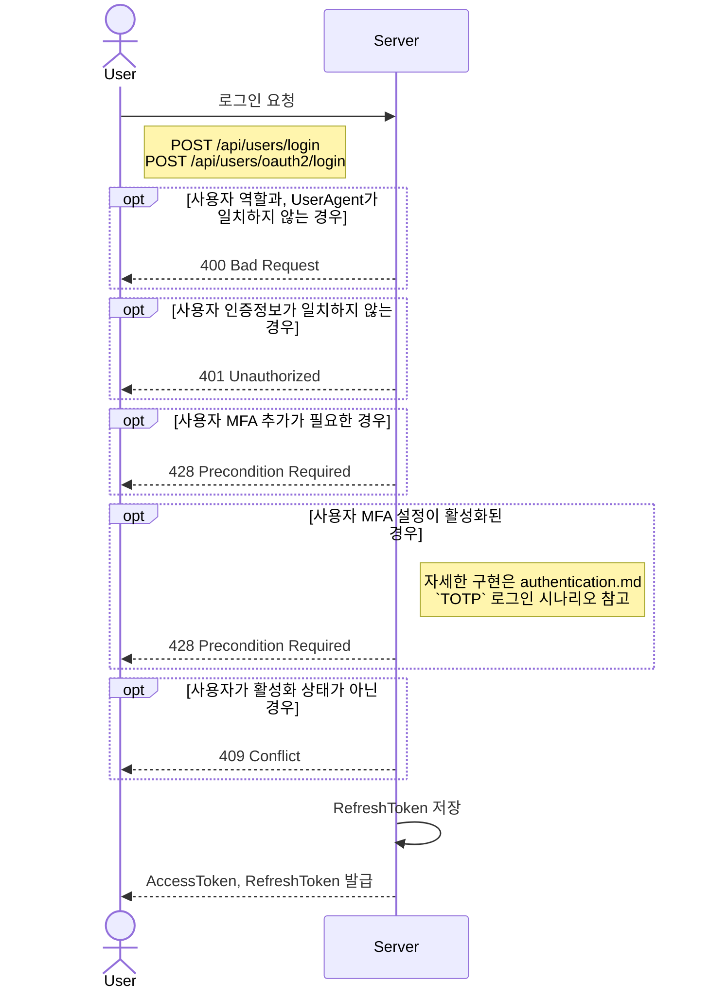

# ParentCaringService

## 서비스 소개

- 보호자·파트너·어드민이 공존하는 육아 플랫폼

## 요구사항

- [X] 유저 인증 시스템
    - JWT Access Token
    - Refresh Token Rotation
    - JWK 키 롤오버
    - MFA (TOTP) 적용
- [X] 소셜 로그인 및 기존 계정 링크
- [X] 어드민 임퍼소네이션
- [X] 세션 목록·원격 로그아웃: `GET /me/sessions`, `DELETE /me/sessions/{id}`
- [X] 키 롤오버 자동화: 신규 키 추가 -> 기존 키 그레이스 기간 -> 폐기

## 프로젝트 실행 방법

- 실행 : `gradle bootRun`
- 테스트
    - `docker compose up -d`
    - `gradle test`

## API 문서

- `gradle copyApiDocs` 실행, `build/assets/index.html` 열기
- `gradle bootJar`로 빌드 후 실행, `GET /swagger/index.html` 접속

## 프로젝트 구조

### 패키지 구조

```text
src/
├── user/
│   ├── adapter/
│   │   └── in/
│   │       └── web/
│   │           └── UserApi.java
│   ├── port/
│   │   ├── inp/
│   │   │   ├── RegisterUser.java
│   │   │   ├── LoginUser.java
│   │   │   └── OAuth2LoginUser.java
│   │   └── outp/
│   │       └── UserRepository.java
│   └── domain/
│       ├── User.java
│       └── UserRole.java
├── security/
│   ├── filter/
│   │   └── JwtTokenFilter.java
│   ├── jwt/
│   │   └── JwtTokenProvider.java
│   └── oauth2/
│       ├── OAuth2AuthenticationProvider.java
│       └── GoogleOAuth2AuthenticationProvider.java
├── config/
│   └── SecurityConfig.java
└── integration/
    └── google/
        └── OAuth2GoogleProfileClient.java
```

- 의미를 가지는 도메인, 또는 외부 노출되는 API, 설정 파일 등으로 패키지를 구분

### 아키텍쳐 구조

- 헥사고날 아키텍쳐로 도메인, 포트, 유즈케이스, 어뎁터 형식을 사용
- 하나의 도메인 아래 크게 4가지의 패키지로 구분

1. `domain`
    - 도메인의 핵심 정보를 담고 있는 엔티티 파일
    - 엔티티 내부에는 비즈니스 로직을 함수로 가지고 있음
2. `port`
    - 엔티티를 사용할 수 있도록 외부로 노출하는 유즈케이스
3. `application`
    - 유즈케이스를 실제로 구현한 서비스 파일
    - 이외에도 서비스 파일에서 사용하는 DTO나, 기타 로직 파일들을 위치
4. `adapter`
    - 외부로부터 전달받은 요청을 처리해주는 API 파일들을 위치

## 기능

### 인증

#### 로그인 방식

- ID + PWD 방식
- OAuth2

#### 로그인 과정

1. 사용자 로그인 요청 (이메일-PWD, OAuth2)
2. 로그인 가능한지 확인
3. 사용자 정보 확인 후, `AccessToken`, `RefreshToken` 발급
    - `AccessToken`: 15분간 유지
    - `RefreshToken`: 1일간 유지
        - 발급 직후, `refresh_token`테이블에 저장
4. 발급 받은 `AccessToken`으로 사용자가 서버에 요청

##### 다이어그램



### JWK 키 롤 오버

#### 설명

- JWS 서명을 하기 위해 필요한 JWK 암호화키를 표현하는 JSON 표현 형식
- `GET /.well-known/jwks.json`으로 현재 등록된 JWK Set을 확인 가능
- 그레이스 기간(1시간)을 설정해서, 키 롤오버가 가능하도록 설정
- 스케줄러 등록으로, 신규 JWK 추가 후, 유효기간+그레이스 기간이 지난 JWK는 삭제 처리하도록 자동화
    - `JWKSetRotationScheduler`

### 임퍼소네이션

#### 설명

- `ADMIN`, `MASTER` 권한을 가진 어드민 사용자가, 다른 유저의 인증정보를 취득할 수 있는 기능
- 임퍼소네이션 한 인증정보를 사용하는 경우 `impersonation_log` 기록됨
- 임퍼소네이션으로 인증 정보 발급 시 claims에 `impersonatorId`로 저장하여 발급
- `JwtAuthenticationFilter`에서 `impersonatorId` 확인 시, 로그 저장

#### 코드

```java
// 어드민 임퍼소네이션인 경우, 저장
if(principal.isImpersonation()){
String ip = request.getRemoteAddr();
String actionDetails = actionDetailsExtractor.extractActionDetails(request);

    updateImpersonationLog.

register(
        principal.impersonatorId(),principal.

id(),ip,ImpersonationType.ACTION,actionDetails
    );
            }
```

### 세션 목록 및 원격 로그아웃

#### 설명

- RDB에 등록된 RefreshToken 목록을, 세션 형식으로 표출
- `DELETE /me/sessions/{sessionId}` 요청 시, 등록된 세션을 만료 처리
