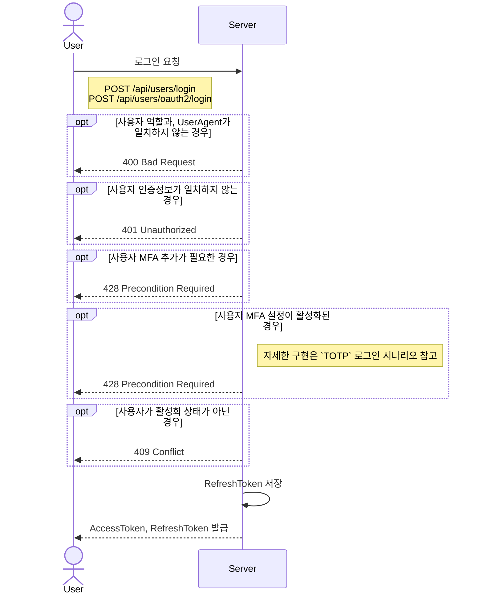
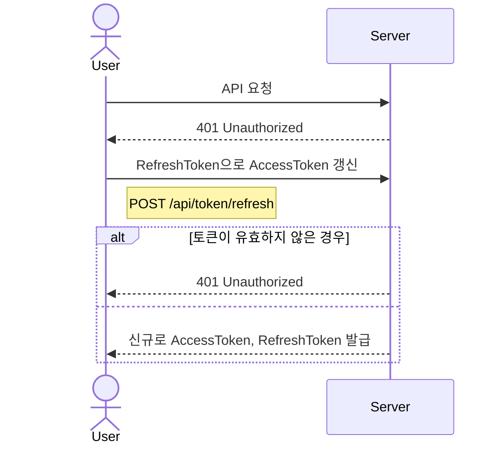
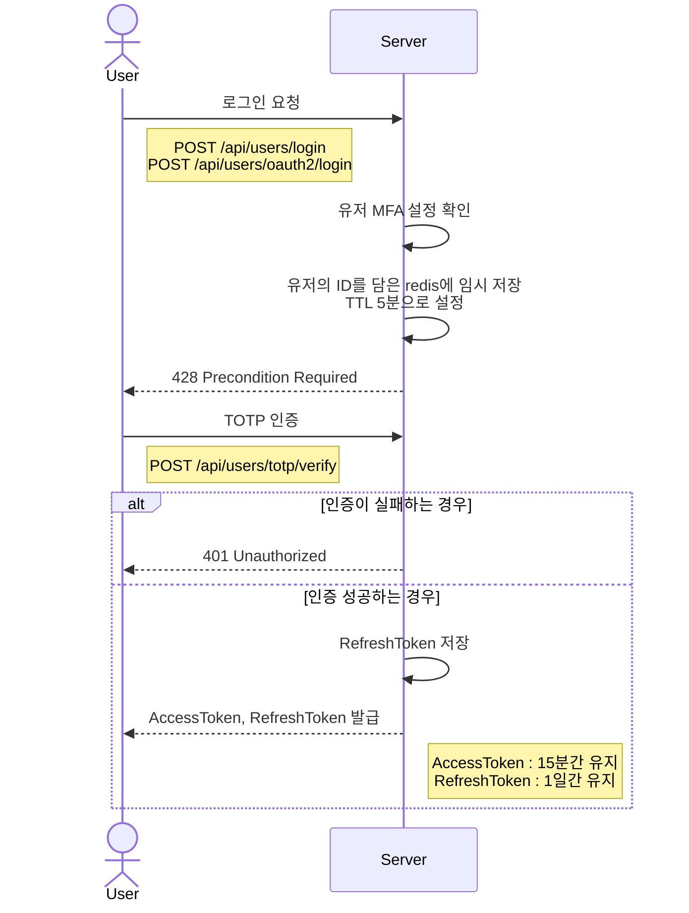

# 로그인 인증

## 로그인 시나리오

1. 사용자 로그인 요청 (이메일-PWD, OAuth2)
2. 로그인 가능한지 확인
3. 사용자 정보 확인 후, `AccessToken`, `RefreshToken` 발급
    - `AccessToken`: 15분간 유지
    - `RefreshToken`: 1일간 유지
        - 발급 직후, `refresh_token`테이블에 저장
4. 발급 받은 `AccessToken`으로 사용자가 서버에 요청

### 다이어그램

## `Access Token` 만료 시나리오

1. `AccessToken`이 만료된 경우, `401 Unauthorized` 응답 리턴
2. 저장된 `RefreshToken`으로 신규 `AccessToken` 발급 요청
3. `RefreshToken`이 유효한 경우, 신규 `AccessToken`과 `RefreshToken`으로 재발급
4. `RefreshToken`이 유효하지 않은 경우, `401 Unauthorized` 응답 리턴

### 다이어그램

## `TOTP` 로그인 시나리오

1. 사용자 로그인 요청 (이메일-PWD, OAuth2)
2. MFA 설정이 `True`인 경우, 유저 Id를 Redis에 저장 후 `428 Precondition Required` 리턴
3. TOTP 인증, 요청 API에 인증 요청
4. 인증이 완료된 경우, AccessToken, RefreshToken 발급

### 다이어그램

