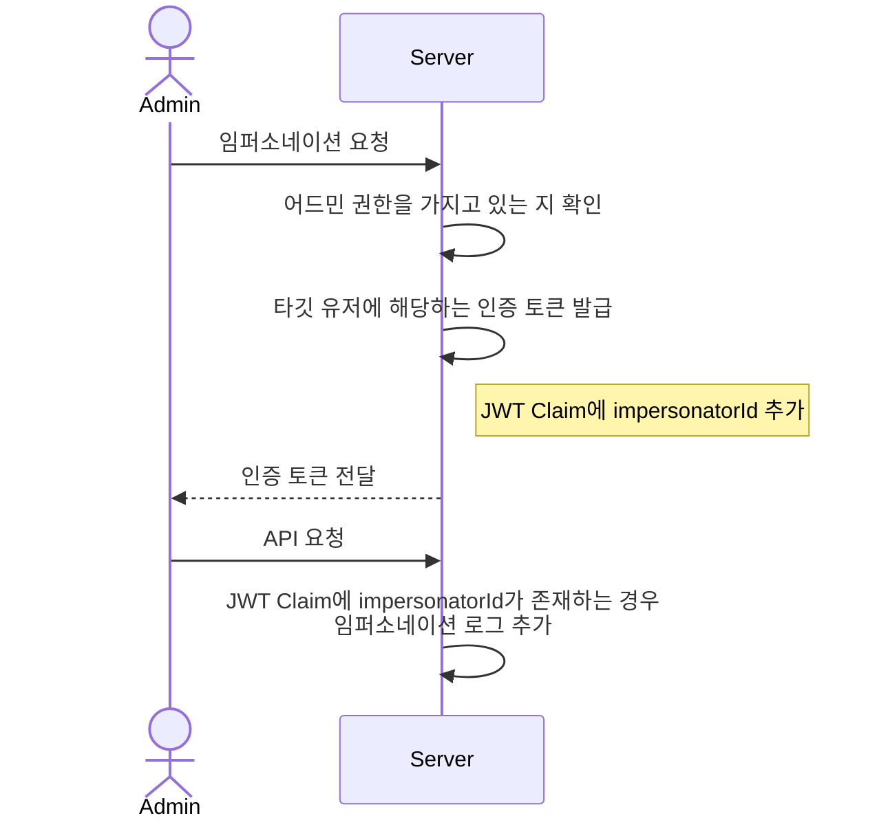

# 어드민 임퍼소네이션

## 기능 정의

- `ADMIN`, `MASTER` 권한을 가진 유저가, 다른 유저로 인증할 수 있도록 하는 기능
- 임퍼소네이션 기능이 사용 된 경우, 반드시 로그를 남겨야 함

## 다이어그램



## 코드

```java
// com.lumanlab.parentcaringservice.security.filter.JwtAuthenticationFilter

// 어드민 임퍼소네이션인 경우, 저장
if (principal.isImpersonation()) {
    String ip = request.getRemoteAddr();
    String actionDetails = actionDetailsExtractor.extractActionDetails(request);

    updateImpersonationLog.register(
            principal.impersonatorId(), principal.id(), ip, ImpersonationType.ACTION, actionDetails
    );
}
```

- JWT 인증 필터에서, 임퍼소네이션 여부 체크
