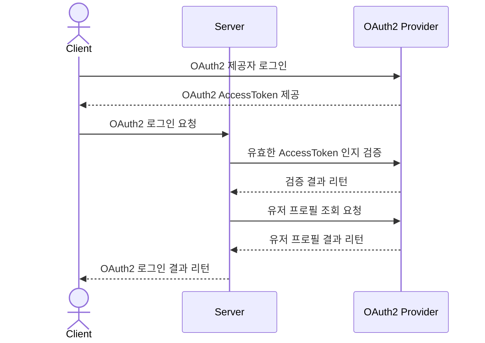

# OAuth2

## 동작 방식

1. Client 측에서, OAuth2 로그인 호출 후 AccessToken 취득
2. 취득한 AccessToken을 `POST /users/login/oauth2`로 전달
3. Server에서는 OAuth2 제공자에게 해당 토큰의 유효성 검증 및 OAuth2 UserId를 전달
4. OAuth2 UserId를 가지고 있는 유저를 조회
5. 해당 유저 정보를 바탕으로 로그인 처리

## 다이어그램

## 도메인

### OAuth2Link

- OAuth2 연동 정보를 저장하는 엔티티
- User-OAuth2Link는 1:N 관계

## 테스트

1. `GET /oauth2.html` 접속
2. `Sign in with Google` 버튼 클릭
3. `Access Token`을 복사 후, 요청 시 사용
